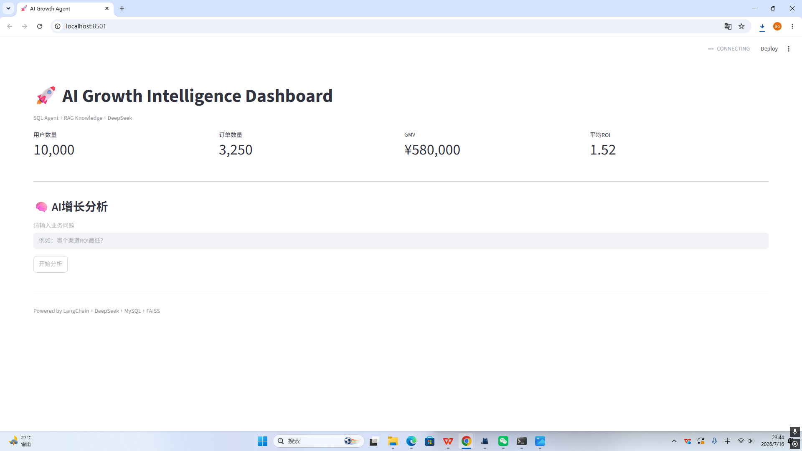
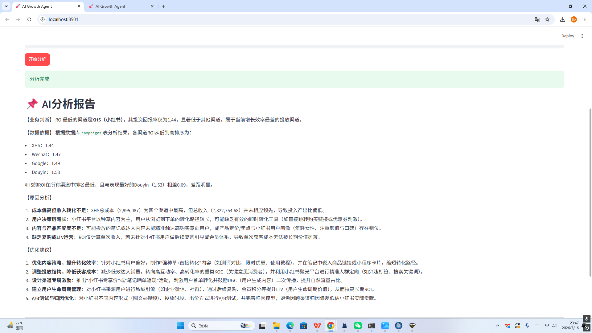

# AI-Growth-Agent

基于 LangChain + DeepSeek + RAG + SQL Agent 的互联网增长分析智能体。

## 项目介绍

实现一个 AI 增长分析助手，可以：

- SQL Agent 自动分析业务数据库
- RAG Agent 检索运营规则知识库
- DeepSeek LLM 生成增长策略
- Streamlit Dashboard 可视化业务指标


## 技术栈

Python
LangChain
DeepSeek API
FAISS
Streamlit
SQLite


# AI-Growth-Agent

基于 LangChain + DeepSeek + RAG + SQL Agent 的互联网增长分析智能体。

## 项目介绍

实现一个 AI 增长分析助手，可以：

- SQL Agent 自动分析业务数据库
- RAG Agent 检索运营规则知识库
- DeepSeek LLM 生成增长策略
- Streamlit Dashboard 可视化业务指标


## 技术栈

- Python
- LangChain
- DeepSeek API
- FAISS Vector Database
- Streamlit
- SQLite
- Pandas


## 系统架构

用户问题
 ↓
Growth Agent
 ↓
 ├── SQL Agent
 │      ↓
 │   数据库分析
 │
 ├── RAG Agent
 │      ↓
 │   知识库检索
 │
 ↓
DeepSeek
 ↓
增长分析报告


## Demo

支持问题：

- 哪个渠道ROI最高？
- ROI下降原因？
- 用户增长分析？
- 产品运营优化建议？

# 📊 Dashboard Preview


## 首页指标展示




## AI增长分析结果



我这样写readme行不行


## 运行


安装依赖：

```bash
pip install -r requirements.txt
streamlit run streamlit_app.py
